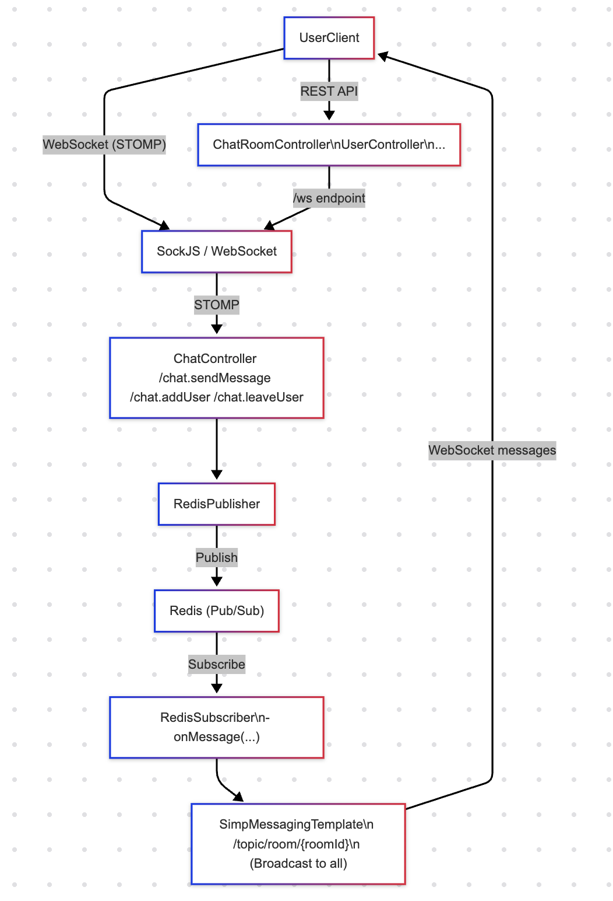

# 웹소켓 및 REST API를 활용한 실시간 채팅 서버 구현

본 문서는 **웹소켓과 REST API를 사용하여 실시간 채팅 기능과 채팅방 관리 기능을 제공하는 서버**를 구현한 내용과 아키텍처 설계를 정리합니다. 프로젝트는 **Java + Spring Boot**로 작성되었으며, **Redis Pub/Sub**를 통해 메시지를 교환합니다.

## 1. 목표

* 웹소켓과 REST API를 사용해 **다중 클라이언트**가 실시간으로 채팅 메시지를 주고받을 수 있도록 구현
* **채팅방 생성**, **채팅방 참여**, **사용자 관리**, **메시지 전송** 등 기능 제공
* **메모리**(Redis 등) 사용 전략 및 서버 아키텍처 설계

## 2. 기능 요구 사항 충족 여부

### 1. **채팅방 관리**
* REST API를 통해 채팅방을 생성하고, 채팅방 목록(또는 사용자 본인이 참여 중인 방 목록)을 조회할 수 있습니다.
* 각 채팅방은 **고유 ID**와 **이름**을 가집니다.
* 본 예제에서는 "사용자가 0명이 된 방을 자동 삭제"하는 로직은 구현되어 있지 않지만, 필요 시 확장 가능하도록 설계되었습니다.

### 2. **채팅방 입장/퇴장 관리**
* 사용자는 **WebSocket** 연결 후, **STOMP** 프로토콜을 통해 특정 채팅방에 입장하거나 퇴장할 수 있습니다.
* REST API를 통해 참여한 뒤, WebSocket을 통해 메시지 교환을 시작합니다.

### 3. **메시지 교환**
* 채팅방 내 사용자는 **실시간**으로 메시지를 주고받습니다.
* 메시지는 **Redis Pub/Sub**를 통해 중계되어, 동일 방을 구독 중인 모든 사용자에게 전파됩니다.
* 메시지는 **휘발성**으로, 서버 재시작 시 유지되지 않습니다.

### 4. **사용자 연결 관리**
* WebSocket 세션을 통해 사용자 연결을 관리합니다.
* 입장 시 `JOIN` 메시지, 퇴장 시 `LEAVE` 메시지를 발행하여 다른 사용자에게 알립니다.

## 3. 기술 요구 사항

* **언어 및 프레임워크**: Java 17 + Spring Boot 3.x
* **웹소켓**: SockJS + STOMP 사용
* **데이터 구조 / 저장**:
   * 채팅 메시지: **Redis Pub/Sub**(휘발성), 별도 DB 저장 없음
   * 채팅방 정보: **In-memory Map** 기반 저장 (실무에서는 RDB/Mongo/Redis로 확장 가능)
* **메모리 관리**:
   * 채팅 메시지는 Redis를 통해 전달만 하며, 서버 메모리에 저장하지 않음
   * 채팅방 정보는 `ConcurrentHashMap`에 저장
   * 사용자별 세션 관리는 Spring WebSocket이 내부적으로 관리


## 4. 아키텍처 


1. **사용자가 REST API로 채팅방 생성/참여**
  - ChatRoomController가 Map(메모리) 채팅방 정보 저장

2. **사용자가 WebSocket 연결**
  - STOMP로 `/chat.sendMessage` 등 매핑된 엔드포인트 호출

3. **메시지 발행**
  - RedisPublisher가 메시지를 Redis Pub/Sub 채널에 발행

4. **메시지 수신 및 브로드캐스트**
  - RedisSubscriber가 수신
  - SimpMessagingTemplate를 통해 `/topic/room/{roomId}`로 브로드캐스트

## 5. 데이터 구조 및 저장소 선택

### 1. **채팅방 정보**:
  - `ConcurrentHashMap<String, ChatRoom>` 형태로 방을 저장.
  - 실제 서비스에서는 RDB나 Redis, MongoDB 등 영속 저장소로 대체 가능.

### 2. **메시지**:
  - 휘발성으로 Redis Pub/Sub 사용.
  - DB 저장은 하지 않음(필요 시 확장 가능).

### 3. **사용자 정보**:
  - 간단히 `UserCreator`를 통해 In-memory로 생성.
  - (실무에서는 DB에 User Entity 저장)

## 6.실행 및 테스트 가이드

### 1. **Redis 실행**
- Redis는 별도의 `docker-compose.yml` 파일에 정의되어 있습니다. 터미널에서 아래 명령어를 실행하여 Redis 컨테이너를 백그라운드로 실행하세요:

```bash
docker-compose up -d redis
```

### 2. **서버 실행**
- Spring Boot 애플리케이션을 아래 명령어로 실행합니다. 이 명령어는 `local` 프로파일을 활성화하며, 서버 포트를 8080으로 설정합니다:

```bash
./gradlew bootRun --args='--spring.profiles.active=local --server.port=8080'
```

### 3. **클라이언트 접속**
- 웹 브라우저를 열고 다음 URL로 (해당 URL로 여러개의 탭을 열어주세요.) 접속하세요 : http://localhost:8080/chat.html

### 4. **사용 시나리오**

**로그인 (회원가입)**
- 클라이언트 페이지에서 사용자 이름과 이메일을 입력하고 "로그인" 버튼을 클릭합니다. 로그인 성공 시, alert 창에 사용자 ID가 표시되고, 채팅방 생성/참여 섹션으로 전환됩니다.

**채팅방 생성**
- "채팅방 생성" 영역에서 원하는 채팅방 이름을 입력한 후 "생성" 버튼을 클릭합니다. 생성 성공 시, alert 창에 생성된 채팅방의 **roomId**가 표시됩니다. 이 roomId를 복사해두세요.

**채팅방 참여**
- "채팅방 참여" 영역에 복사한 **roomId**를 입력하고 "참여" 버튼을 클릭합니다. 참여 성공 시, 해당 채팅방에 입장하여 실시간 메시지 교환을 시작할 수 있습니다.

**채팅 기능**
- 채팅방에 입장한 후, 메시지 입력란에 메시지를 입력하고 전송 버튼을 클릭합니다. WebSocket을 통해 같은 채팅방에 있는 모든 사용자에게 메시지가 실시간으로 전송됩니다.

**채팅방 나가기**
- "나가기" 버튼을 클릭하면 채팅방에서 퇴장되며, 다시 채팅방 생성/참여 화면으로 돌아갑니다.

---

이 가이드를 따라 실행하면, Redis와 Spring Boot 서버가 실행된 상태에서 클라이언트 페이지(http://localhost:8080/chat.html) 를 통해 사용자 로그인, 채팅방 생성 및 참여, 실시간 채팅 기능을 테스트할 수 있습니다.


## 7.향후 개발 계획 및 개선 방향

현재 시스템은 초기 단계부터 다양한 접근 방식을 통해 채팅 기능을 검증하고 확장 가능한 구조로 구현되었습니다. 구체적인 개발 단계와 고민한 방향성은 다음과 같습니다.

### 1. 현재 구현 단계

* **POJO 기반 WebSocket 테스트** - 최초로 단순한 POJO(WebSocket API)를 사용하여 채팅 메시지 송수신 기능을 테스트했습니다.
* **STOMP 프로토콜 도입** - WebSocket 위에 STOMP 프로토콜을 적용하여 메시지 라우팅을 테스트하였습니다.
* **서버 스케일 아웃 고려 – Redis Pub/Sub 적용** - 다중 서버 환경에서의 메시지 동기화 및 확장성을 위해 Redis Pub/Sub를 활용하여 WebSocket 메시지를 브로드캐스트하도록 설계했습니다.
* **웹 클라이언트를 대상으로 한 최종 구현** - 웹 기반 클라이언트를 통해 REST API와 WebSocket(STOMP) 연동을 테스트하여 실제 서비스 형태에 가까운 환경을 구현하였습니다.

### 2. 향후 개발 및 확장 계획

### 2.1 메시지 처리 및 전송 개선

* **메시지 길이 제한** - 너무 긴 메시지가 전송되지 않도록 제한을 두어, 클라이언트와 서버 모두에서 안정적인 데이터 전송이 이루어지도록 할 계획입니다.
* **메시지 텍스트 압축** - 전송되는 텍스트 데이터의 크기를 줄이기 위해 압축 알고리즘을 적용하여 네트워크 대역폭 사용을 최적화할 예정입니다.
* **파일 전송 지원** - 단순 텍스트 메시지 외에도 이미지, 동영상, 문서 등 파일 형태의 메시지도 지원할 수 있도록 확장할 계획입니다. 이를 위해 파일 업로드 API와, WebSocket 메시지에 파일 메타데이터 및 다운로드 URL을 포함하는 방식으로 설계할 수 있습니다.

### 2.2 서버 아키텍처 분리 및 확장

* **REST API Server와 WebSocket Server 분리** - 현재는 단일 애플리케이션 내에서 REST API와 WebSocket 서버를 함께 운영하고 있지만, 향후 서버의 부하와 확장성을 고려하여 두 서버를 **독립된 마이크로서비스**로 분리할 계획입니다. 이를 통해 각 서비스에 최적화된 리소스 할당과 독립적인 스케일 아웃이 가능해질 것입니다.
* **메시지 영구 저장 및 검색 기능 개선** - 현재 채팅 메시지는 휘발성으로 Redis를 통해 전달됩니다. 향후 사용자의 대화 내역 보존 및 검색 기능을 위해, **MongoDB**와 같은 NoSQL 데이터베이스를 도입하여 메시지를 영구 저장하고, 검색/분석 기능을 추가할 예정입니다.

### 2.3 추가 고려 사항

* **보안 강화** - WebSocket 연결, REST API 호출 시 인증 및 인가를 강화하고, 데이터 암호화 및 메시지 변조 방지 기능을 추가할 예정입니다.
* **모니터링 및 로깅** - 시스템 전반의 성능 모니터링과 로깅 체계를 강화하여, 문제 발생 시 신속한 대응이 가능하도록 할 계획입니다.

## 결론

현재 시스템은 POJO 기반 WebSocket 테스트에서 시작하여 STOMP와 Redis Pub/Sub를 적용한 확장 가능한 채팅 서버를 구현하였습니다. 향후 개발 방향은 메시지 처리 최적화, 파일 전송 지원, 서버 아키텍처의 분리 및 영구 저장소 도입 등을 통해 더욱 풍부하고 확장 가능한 채팅 서비스를 제공하는 것입니다.

이와 같은 개발 계획을 바탕으로, 앞으로의 개선 작업을 진행할 예정입니다.